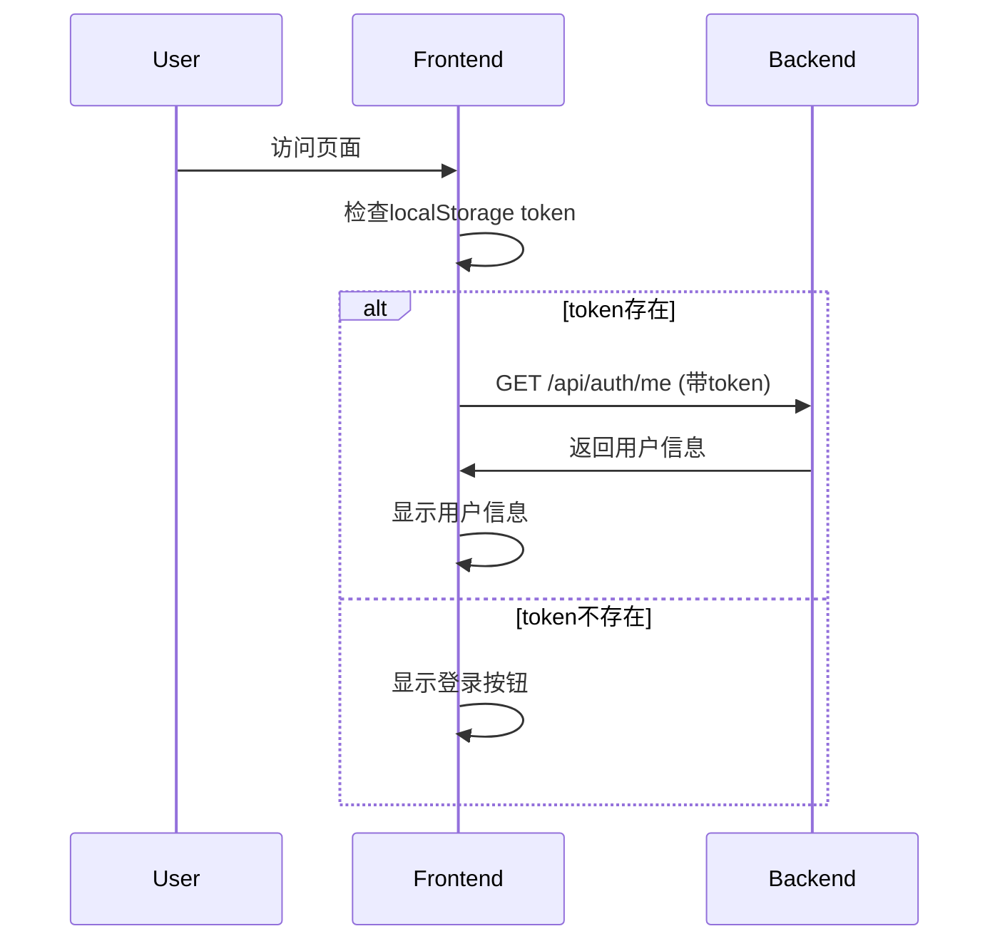

# LLM Debate Arena v4.3 更新计划

## 📅 更新时间
2025-11-30

## 🎯 更新目标

### 1. 固定侧边栏（类似ChatGPT）✅
**当前状态**：浮动侧边栏
**目标**：固定左侧侧边栏，始终可见

**实现方案**：
```typescript
// 布局结构
<div className="flex h-screen">
  {/* 左侧固定侧边栏 - 240px */}
  <aside className="w-60 bg-white border-r border-gray-200">
    {/* 历史记录列表 */}
    {/* 底部用户信息 */}
  </aside>
  
  {/* 右侧主内容区 - flex-1 */}
  <main className="flex-1">
    {/* 辩论竞技场 */}
  </main>
</div>
```

**侧边栏结构**：
- 顶部：Logo + 新建对话按钮
- 中间：历史记录列表（滚动）
- 底部：用户信息区
  - 未登录：登录/注册按钮
  - 已登录：头像 + 用户名

### 2. 用户系统

#### 2.1 数据库设计
```sql
-- 用户表
CREATE TABLE users (
    id INTEGER PRIMARY KEY,
    username VARCHAR(50) UNIQUE NOT NULL,
    email VARCHAR(100) UNIQUE NOT NULL,
    password_hash VARCHAR(255) NOT NULL,
    display_name VARCHAR(100),
    avatar_url VARCHAR(500),
    matches_count INTEGER DEFAULT 0,
    created_at DATETIME,
    last_login DATETIME
);

-- 比赛表添加用户关联
ALTER TABLE matches ADD COLUMN user_id INTEGER;
```

#### 2.2 后端API
```yaml
POST /api/auth/register      # 注册
POST /api/auth/login         # 登录
GET  /api/auth/me            # 获取当前用户信息
GET  /api/auth/logout        # 登出
```

#### 2.3 前端页面
**登录页面** (`/login`)
- 极简黑白风格
- 用户名/邮箱 + 密码
- 登录按钮（黑色）
- 跳转注册链接

**注册页面** (`/register`)
- 用户名 + 邮箱 + 密码 + 确认密码
- 注册按钮（黑色）
- 跳转登录链接

#### 2.4 认证流程
```typescript
// 使用 JWT Token
localStorage.setItem('token', token)

// API请求带上token
headers: {
  'Authorization': `Bearer ${token}`
}

// 历史记录按用户过滤
GET /api/tournament/matches/history?user_id={user_id}
```

### 3. 辩论显示优化

**当前**：
```
🔵 正方
Round 1
...
```

**修改后**：
```
🔵 正方 - GPT-4o
Round 1
...
```

**实现**：
```typescript
<div className="flex items-center mb-2">
  <span className="font-bold">
    {turn.speaker_role === 'proponent' ? '🔵 正方' : '🔴 反方'}
  </span>
  <span className="text-sm text-gray-600 ml-2">
    - {turn.model_id}
  </span>
  <span className="text-sm text-gray-500 ml-auto">
    Round {turn.round_number}
  </span>
</div>
```

### 4. 天梯榜样式调整

#### 4.1 按钮样式
**当前**：金色渐变
```tsx
className="bg-gradient-to-r from-yellow-500 to-orange-500"
```

**修改后**：黑白风格
```tsx
className="bg-gray-900 text-white hover:bg-gray-800"
```

#### 4.2 ELO历史 → 对战胜负

**删除**：
```tsx
<details>
  <summary>查看 ELO 历史趋势</summary>
  <LineChart ... />
</details>
```

**新增**：
```tsx
<details>
  <summary>查看历史对战</summary>
  <div className="space-y-2">
    {matches.map(match => (
      <div className="flex items-center justify-between">
        <span>{match.opponent}</span>
        <span className={match.result === 'win' ? 'text-green-600' : 'text-red-600'}>
          {match.result === 'win' ? '胜' : '负'}
        </span>
      </div>
    ))}
  </div>
</details>
```

**API**：
```yaml
GET /api/tournament/competitor/{model_id}/matches
Response:
[
  {
    "match_id": "xxx",
    "opponent_model_id": "claude-3.5-sonnet",
    "result": "win",  // win | loss | draw
    "created_at": "2024-01-01"
  }
]
```

## 🎨 设计风格指南

### 颜色方案
```css
/* 主色调 - 黑白灰 */
--color-primary: #111827;     /* gray-900 */
--color-secondary: #6B7280;   /* gray-500 */
--color-bg: #FFFFFF;          /* white */
--color-border: #E5E7EB;      /* gray-200 */

/* 状态色 */
--color-success: #10B981;     /* green-500 */
--color-error: #EF4444;       /* red-500 */
--color-warning: #F59E0B;     /* yellow-500 */
```

### 按钮样式
```tsx
// 主按钮
<button className="bg-gray-900 text-white px-4 py-2 rounded hover:bg-gray-800">
  
// 次要按钮
<button className="bg-white text-gray-900 border border-gray-300 px-4 py-2 rounded hover:bg-gray-50">

// 链接按钮
<button className="text-gray-600 hover:text-gray-900">
```

## 📝 实现步骤

### Phase 1: 基础架构（已完成部分）
- [x] 用户数据模型（UserModel）
- [x] 认证模块（auth.py）
- [x] 用户相关Pydantic模型
- [ ] 数据库迁移

### Phase 2: 后端API
- [ ] 用户注册/登录接口
- [ ] JWT认证中间件
- [ ] 历史记录按用户过滤
- [ ] 获取模型对战记录API

### Phase 3: 前端重构
- [ ] Arena.tsx - 固定侧边栏布局
- [ ] 登录/注册页面
- [ ] 用户信息显示组件
- [ ] 辩论显示添加模型名称
- [ ] Leaderboard.tsx - 样式调整

### Phase 4: 集成测试
- [ ] 用户注册流程测试
- [ ] 登录状态持久化测试
- [ ] 历史记录过滤测试
- [ ] 样式一致性检查

## 🔧 技术细节

### 认证流程


### 侧边栏布局
```
┌────────────────────────────────────┐
│ 🏠 辩论竞技场          [+] 新建    │ <- 顶部固定
├────────────────────────────────────┤
│                                    │
│  📝 Python vs Java                │
│     GPT-4o vs Claude 3.5          │
│     2小时前                        │
│                                    │
│  📝 AI艺术创作                     │
│     GPT-4o vs GPT-4o-mini         │
│     昨天                           │
│                                    │
│  📝 远程办公效率                   │ <- 滚动区域
│     ...                           │
│                                    │
│                                    │
│  (更多历史记录...)                │
│                                    │
│                                    │
├────────────────────────────────────┤
│  👤 未登录                         │ <- 底部固定
│  [登录] [注册]                     │
└────────────────────────────────────┘
```

## 🚀 后续优化

1. **用户头像上传**：支持自定义头像
2. **用户统计**：个人对战记录统计
3. **收藏功能**：收藏感兴趣的辩题
4. **分享功能**：分享历史辩论
5. **深色模式**：支持暗黑主题

## 📊 数据迁移

```python
# 数据库迁移脚本
def migrate_v4_3():
    """添加用户表和user_id字段"""
    # 1. 创建用户表
    # 2. 添加matches.user_id字段
    # 3. 历史数据user_id设为NULL
```

## 🎉 总结

本次更新主要聚焦在：
1. ✅ 用户系统基础架构
2. ✅ 固定侧边栏布局
3. ✅ 黑白极简风格统一
4. ✅ 辩论体验优化

所有功能都遵循极简黑白设计风格，提升整体一致性和用户体验。
